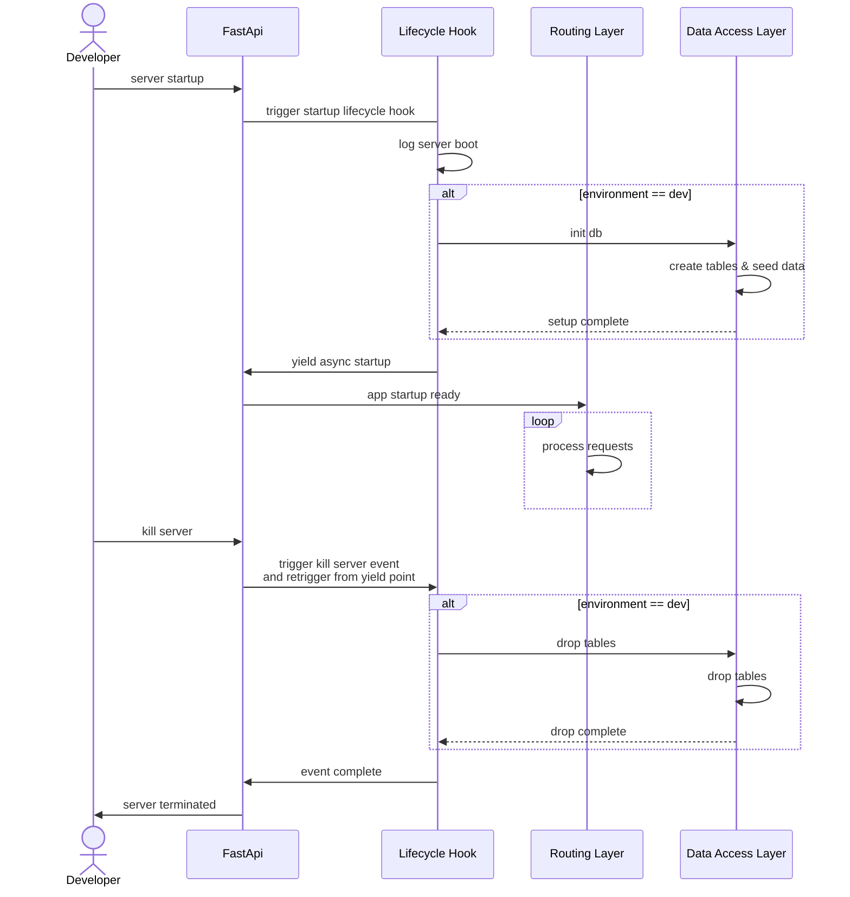
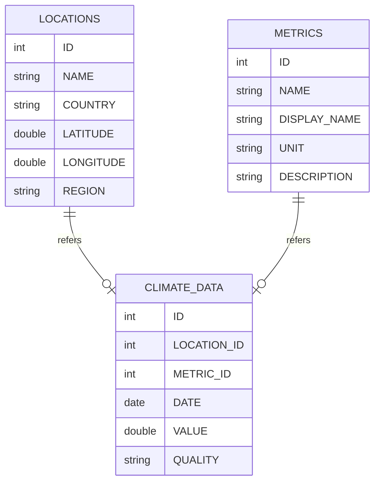
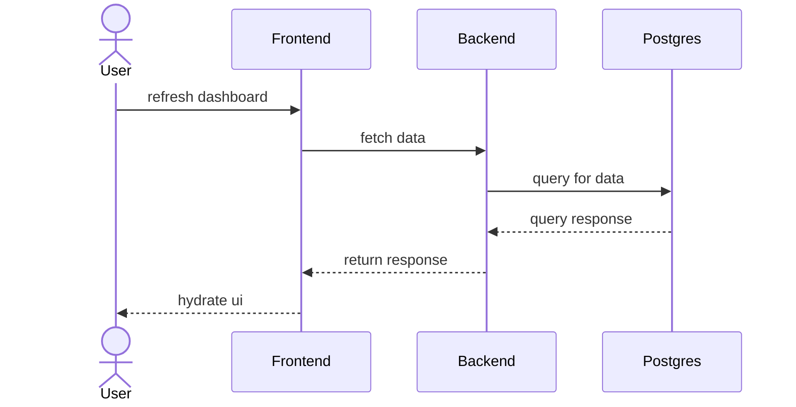

# Omaha Take Home: EcoVision: Climate Visualizer Backend

The backend for the EcoVision app utilizes FastApi. For a full api spec please see: http://127.0.0.1:8000/docs

## Project Dependencies

- fastapi
- python 3.13.1
- venv
- postgres 17

## Getting Started

### Server Life Cycle

### 1. Activate venv

Start virtual environment to encapsulate dependencies:

`source .venv/bin/activate`

### 2. Install Requirements

Install package dependencies via pip declared in requirements.txt:

`pip install -r requirements.txt`

### 3. Server Startup

Use the .env file to load environment files. If the `ENVIRONMENT` is dev, the startup script will load the seed data.

#### Production Startup

`fastapi run app.py`

#### Dev Startup

`fastapi dev app.py`

#### Dev Startup With Hot Reload

`fastapi dev app.py --reload`

## Unit Testing

The test suite leverages PyTest. To run the suite use:

`pytest`

## Architecture

### Entity Relationship Diagram

### Sequence Diagram

## Decisions

1. Use FastApi has the underlying framework.

- Reasons:
  - Good dev ex and easy for other developers to onboard
  - Stronger familiarity
  - Fast startup speed + easy access to server lifecycle
  - Route based project structuring becomes simpler

2. Use Postgres for DB

- Reasons:
  - Relational query model is better suited for the OLAP style query pattern
  - Data has strong relational dependencies
  - Postgres has great community support and documentation

3. Create a Data Access Layer (DAL) to interface out queries

- Reasons:
  - Provides a strong interface in case our data source changes at any time in the future.
  - Simplify access patterns from the routing logic
  - Draw clearer lines around application boundary

4. Use SQL Model as the SQL Driver

- Reasons:
  - SQL Model supports almost all SQL databases and even some NoSQL DBs. It can be used as a good interface for queries.
  - Good community support and easy integration points with FastApi. Same creator!
  - Offers ORM style query patterns and raw query execution. Class based definitions were used to define the schema in place while more complicated queries used raw SQL.

5. Unit Testing via Pytest

- Reasons:
  - PyTest is a simple and commonly used framework
  - Easy to run with FastApi

## Improvements

1. Schema Improvements:

- Pull out quality threshold into it's own table and introduce and index value.
- Introduce indexes around name and common join points

2. Write more Unit Tests:

- The PyTest integration is started and the base route is being tested but more unit tests can be added

3. Leverage async more in the APIs

- Concurrent requests can be handled better since this application is proxying a lot of requests to the DB.
