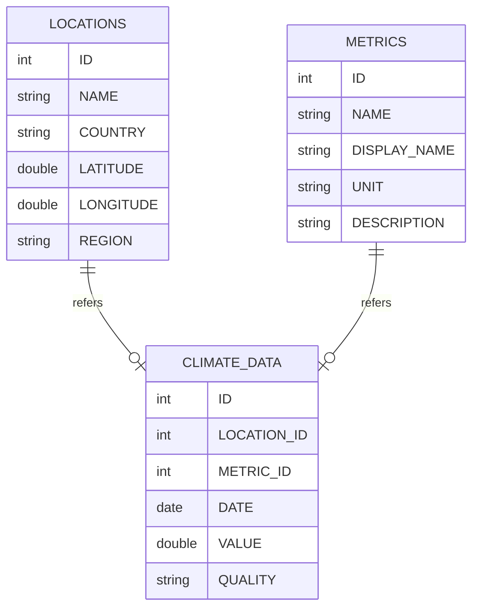
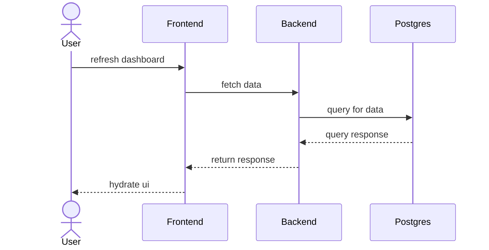

# Omaha Take Home: EcoVision: Climate Visualizer Backend

The backend for the EcoVision app utilizes FastApi. For a full api spec please see: http://127.0.0.1:8000/docs

## Project Dependencies

- fastapi
- python 3.13.1
- venv
- postgres 17

## Getting Started

### 1. Activate venv

Start virtual environment to encapsulate dependencies:

`source .venv/bin/activate`

### 2. Install Requirements

Install package dependencies via pip declared in requirements.txt:

`pip install -r requirements.txt`

### 3. Server Startup

#### Production Startup

`fastapi run app.py`

#### Dev Startup

`fastapi dev app.py`

#### Dev Startup With Hot Reload

`fastapi dev app.py --reload`

## Unit Testing

The test suite leverages PyTest. To run the suite use:

`pytest`

## Architecture

### Entity Relationship Diagram

### Sequence Diagram

