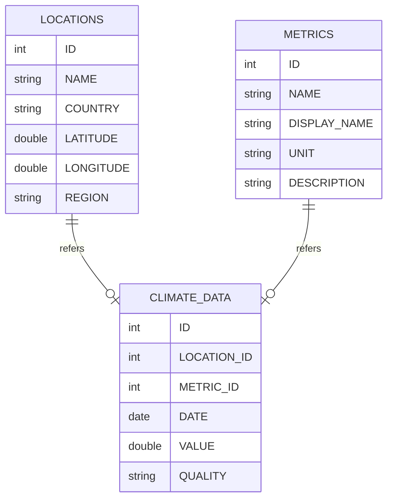

```mermaid
erDiagram
    LOCATIONS {
        int ID
        string NAME
        string COUNTRY
        double LATITUDE
        double LONGITUDE
        string REGION
    }

    METRICS {
        int ID
        string NAME
        string DISPLAY_NAME
        string UNIT
        string DESCRIPTION
    }

    CLIMATE_DATA {
        int ID
        int LOCATION_ID
        int METRIC_ID
        date DATE
        double VALUE
        string QUALITY
    }

    LOCATIONS ||--o| CLIMATE_DATA : refers
    METRICS ||--o| CLIMATE_DATA : refers

```
