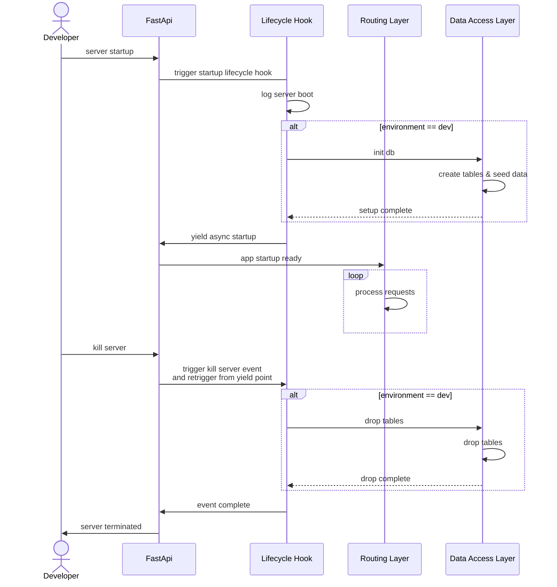

```mermaid
    sequenceDiagram
        actor dev as Developer
        participant fp as FastApi
        participant lf as Lifecycle Hook
        participant rl as Routing Layer
        participant dl as Data Access Layer

        dev->>fp: server startup
        fp->lf: trigger startup lifecycle hook
        lf->>lf: log server boot
        alt environment == dev
            lf->>dl: init db
            dl->>dl: create tables & seed data
            dl-->>lf: setup complete
        end
        lf->>fp: yield async startup
        fp->>rl: app startup ready
        loop
            rl->>rl: process requests
        end
        dev->>fp: kill server
        fp->>lf: trigger kill server event <br>and retrigger from yield point
         alt environment == dev
            lf->>dl: drop tables
            dl->>dl: drop tables
            dl-->>lf: drop complete
        end
        lf->>fp: event complete
        fp->>dev: server terminated
```
